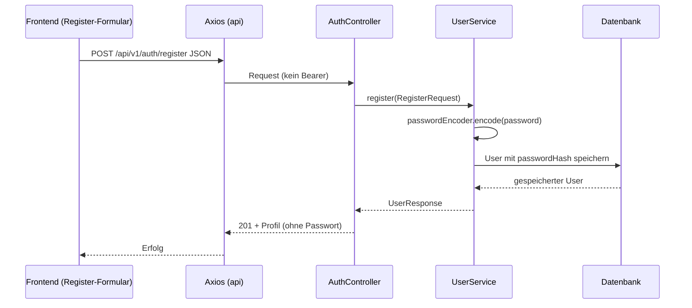
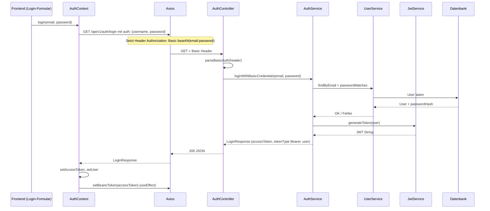
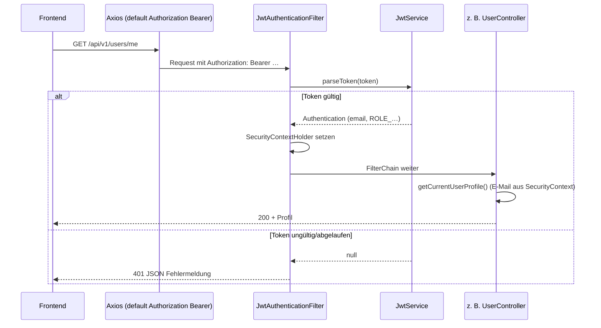

# Meilenstein 1: Authentifizierung — Umsetzung & Ablauf

Dieses Dokument ordnet die **Anforderungen aus der Aufgabenstellung** der **konkreten Implementierung** in StudyBridge zu und beschreibt den **technischen Ablauf** (Frontend ↔ REST-Backend). Es dient als Nachschlagewerk für dich und als Nachweis für die Bewertung.

---

## 1. Anforderungen aus der Aufgabenstellung (Kurzfassung)

| Nr. | Anforderung |
|-----|-------------|
| A | **Vollständiger Durchstich:** Login vom **Frontend bis zum Backend** |
| B | **Erster Authentifizierungsschritt:** **HTTP Basic Authentication** nach üblichem Standard |
| C | **Alle folgenden Nachrichten** zwischen Client und REST-Server: **tokenbasierte Authentifizierung** (empfohlen: **JWT**; OAuth/JWT alternativ) |
| D | **Passwörter:** als **Hash mit Salt** speichern, z. B. **BCrypt** |

Die folgenden Abschnitte zeigen, **wo** und **wie** jede Zeile umgesetzt ist.

---

## 2. Erfüllung der Anforderungen (Mapping)

### A — Vollständiger Durchstich (UI → API)

- **Frontend:** Nutzer gibt E-Mail und Passwort ein (z. B. `LoginPage`), ruft `useAuth().login` auf; der `AuthProvider` (`frontend/src/context/AuthContext.tsx`) ruft `authApi.loginWithBasicAuth` auf und speichert danach Token und Benutzerprofil.
- **Transport:** HTTP-Anfrage an den Spring-Boot-REST-Server (Standard-Port lokal: `8080`, konfigurierbar über `VITE_API_BASE_URL` im Frontend).
- **Backend:** `AuthController` (`backend/src/main/java/de/bht/studybridge/controller/AuthController.java`) empfängt den Login, `AuthService` prüft Zugangsdaten und erzeugt das JWT.

**Automatisierter Nachweis:** Integrationstest `AuthFlowIntegrationTest` (`backend/src/test/java/de/bht/studybridge/AuthFlowIntegrationTest.java`) führt Register → Basic-Login → geschützten `GET /api/v1/users/me` mit Bearer-Token aus.

### B — Basic Authentication (erster Schritt)

- **Standard:** Header `Authorization: Basic <Base64(email:password)>` (RFC 7617 / übliche Basic-Auth-Praxis; „Username“ im Basic-Schema ist hier die **E-Mail**).
- **Client:** Axios wird mit `auth: { username: email, password }` aufgerufen — das setzt den Basic-Header korrekt (`frontend/src/api/authApi.ts`).
- **Server:** `AuthController` prüft `Authorization`, Prefix `Basic `, Base64-Dekodierung und Split am **ersten** `:` (alles davor = E-Mail, alles danach = Passwort; Passwörter mit `:` im Klartext werden korrekt unterstützt).

**Öffentlicher Endpunkt:** `GET /api/v1/auth/login` ist in `SecurityConfig` und `PublicApiRequestMatcher` **ohne JWT** erreichbar, benötigt aber gültige Basic-Credentials für eine erfolgreiche Antwort.

### C — Tokenbasierte Authentifizierung danach (JWT)

- **Antwort auf Login:** JSON mit `accessToken`, `tokenType: "Bearer"` und `user` (`LoginResponse` / `AuthService`).
- **Folgeanfragen:** Client setzt `Authorization: Bearer <accessToken>` auf der gemeinsamen Axios-Instanz (`frontend/src/api/client.ts` — `setBearerToken`).
- **Server:** `JwtAuthenticationFilter` liest `Bearer`, validiert Signatur und Ablauf über `JwtService` (Bibliothek JJWT, HS256). Bei Erfolg wird der Spring-`SecurityContext` mit Rolle gesetzt; geschützte Controller können den Nutzer ableiten.

**Konfiguration:** Geheimer Schlüssel und Gültigkeitsdauer in `backend/src/main/resources/application.properties` (`jwt.secret`, `jwt.expiration-ms`); in Produktion `JWT_SECRET` setzen (mind. 32 Byte für HS256 — siehe `JwtService`).

### D — Passwort-Hashing mit Salt (BCrypt)

- **Speicherung:** Beim Registrieren wird nur ein **BCrypt-Hash** persistiert (`UserService.register` → `passwordEncoder.encode`). BCrypt codiert **Salt und Version** im Hash-String (kein separates Salt-Feld nötig).
- **Prüfung beim Login:** `passwordEncoder.matches(plaintext, passwordHash)` in `UserService.passwordMatches`.
- **Bean:** `BCryptPasswordEncoder` in `SecurityConfig.passwordEncoder()`.

---

## 3. Welche Endpunkte sind öffentlich vs. geschützt?

| Methode | Pfad | Auth |
|---------|------|------|
| `POST` | `/api/v1/auth/register` | Keine (JSON-Body mit Klartext-Passwort nur über TLS in Produktion empfohlen) |
| `GET` | `/api/v1/auth/login` | **Basic** im Header |
| `GET` | `/h2-console/**` | Keine (nur Entwicklung) |
| Sonstige | `/api/v1/**` | **Bearer JWT** (nach erfolgreichem Login) |

Die gleiche Logik spiegelt sich in `PublicApiRequestMatcher` wider: Für öffentliche Pfade wird der JWT-Filter übersprungen; trotzdem verlangt Spring Security für `/api/v1/**` außer den explizit `permitAll`-Routen eine **Authentication** — die liefert bei geschützten URLs entweder ein gültiges JWT (`Bearer`) oder es bleibt unauthentifiziert → 401.

---

## 4. Detaillierte Workflows

### 4.1 Registrierung (ohne Token; kein Meilenstein-„Login“, aber Voraussetzung für Basic-Login)

**Wichtig:** Das Passwort wird **niemals** im Klartext in der DB abgelegt, nur der BCrypt-Hash.

---

### 4.2 Login — erster Schritt: Basic Authentication

**Inhalt des JWT (vereinfacht):**

- **Subject (`sub`):** E-Mail des Nutzers  
- **Claim `role`:** Rolle (z. B. `USER`) für `SimpleGrantedAuthority`  
- **`iat` / `exp`:** Ausgestellt am / Ablauf  
- **Signatur:** HMAC mit konfiguriertem Secret (`JwtService`)

---

### 4.3 Geschützte REST-Anfrage — Bearer JWT

---

## 5. Relevante Dateien (Referenz)

| Thema | Datei(en) |
|-------|-----------|
| Basic-Login API | `backend/src/main/java/de/bht/studybridge/controller/AuthController.java` |
| Login-Logik + JWT-Ausgabe | `backend/src/main/java/de/bht/studybridge/service/AuthService.java` |
| JWT erzeugen/prüfen | `backend/src/main/java/de/bht/studybridge/service/JwtService.java` |
| JWT-Filter | `backend/src/main/java/de/bht/studybridge/security/JwtAuthenticationFilter.java` |
| Öffentliche Pfade (Filter) | `backend/src/main/java/de/bht/studybridge/security/PublicApiRequestMatcher.java` |
| Spring Security Kette | `backend/src/main/java/de/bht/studybridge/config/SecurityConfig.java` |
| Registrierung & Passwort | `backend/src/main/java/de/bht/studybridge/service/UserService.java` |
| Profil (geschützt) | `backend/src/main/java/de/bht/studybridge/controller/UserController.java` |
| Client Basic-Login | `frontend/src/api/authApi.ts` |
| Bearer-Default-Header | `frontend/src/api/client.ts` |
| State im UI | `frontend/src/context/AuthContext.tsx` |
| End-to-End-Test | `backend/src/test/java/de/bht/studybridge/AuthFlowIntegrationTest.java` |
| JWT-/CORS-Konfiguration | `backend/src/main/resources/application.properties` |

---

## 6. Kurzantwort für die Einreichung

StudyBridge erfüllt Meilenstein 1 wie folgt:

1. **Durchstich:** Registrierung und Login laufen über das React-Frontend zur REST-API; der komplette Login-Pfad ist implementiert und durch einen Integrationstest abgedeckt.  
2. **Erster Schritt:** Login nutzt **HTTP Basic** (`Authorization: Basic …`) gemäß gängigem Standard.  
3. **Folgeschritte:** Alle weiteren Zugriffe auf geschützte `/api/v1/**`-Ressourcen verwenden **Bearer JWT**.  
4. **Passwörter:** Werden mit **BCrypt** gehasht (Salt inklusive); Vergleich über `matches`.

---

## 7. Hinweise für Produktion / Bewertungsgespräch

- **TLS:** Basic Auth und JWT im Klartext-Header erfordern **HTTPS** in Produktion.  
- **GET Login:** Die Aufgabenstellung verlangt Basic Auth, nicht zwingend `POST`. Hier ist `GET /api/v1/auth/login` gewählt; Credentials liegen im **Header**, nicht in der URL. Manche Teams bevorzugen aus semantischen Gründen `POST`; funktional ist der Basic-Standard eingehalten.  
- **Geheimnis:** `jwt.secret` muss in echten Umgebungen stark und geheim sein (`JWT_SECRET`).

---

*Stand: generiert anhand des StudyBridge-Codes im Repository. Bei Änderungen an Routen oder Security bitte dieses Dokument mitpflegen.*
