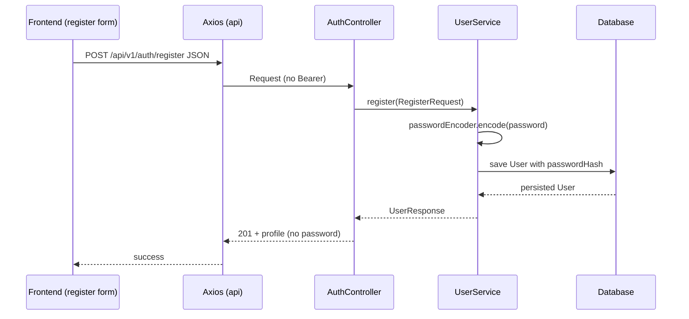
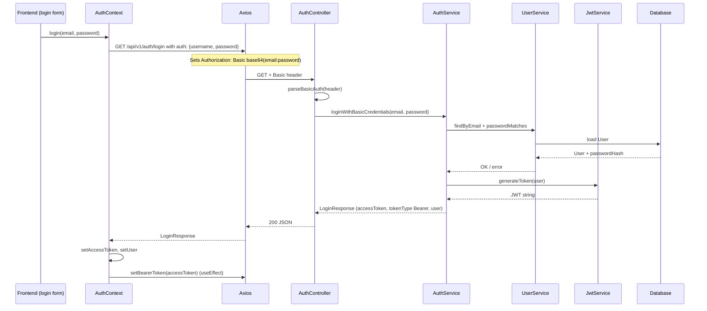
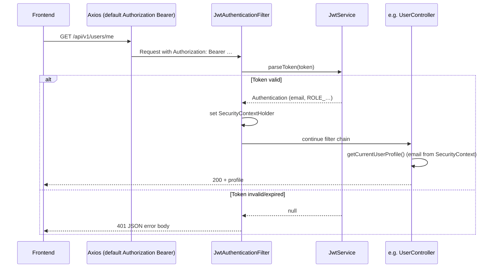

# Milestone 1: Authentication — Implementation and flow

> German edition (for coursework / professor): [MILESTONE1_AUTHENTICATION.md](MILESTONE1_AUTHENTICATION.md)

This document maps the **assignment requirements** to the **concrete StudyBridge implementation** and describes the **technical flow** (frontend ↔ REST backend). Use it as a personal reference.

---

## 1. Assignment requirements (summary)

| # | Requirement |
|---|-------------|
| A | **End-to-end path:** login from **frontend through to the backend** |
| B | **First authentication step:** **HTTP Basic Authentication** following common standards |
| C | **All subsequent messages** between client and REST server: **token-based authentication** (recommended: **JWT**; OAuth/JWT as an alternative) |
| D | **Passwords:** store as **salted hashes**, e.g. **BCrypt** |

The sections below show **where** and **how** each item is implemented.

---

## 2. How requirements are met (mapping)

### A — End-to-end path (UI → API)

- **Frontend:** The user enters email and password (e.g. on `LoginPage`), calls `useAuth().login`; `AuthProvider` (`frontend/src/context/AuthContext.tsx`) calls `authApi.loginWithBasicAuth` and then stores the token and user profile.
- **Transport:** HTTP to the Spring Boot REST server (default local port `8080`, configurable via `VITE_API_BASE_URL` in the frontend).
- **Backend:** `AuthController` (`backend/src/main/java/de/bht/studybridge/controller/AuthController.java`) receives login, `AuthService` validates credentials and issues the JWT.

**Automated proof:** The integration test `AuthFlowIntegrationTest` (`backend/src/test/java/de/bht/studybridge/AuthFlowIntegrationTest.java`) runs register → Basic login → protected `GET /api/v1/users/me` with a Bearer token.

### B — Basic Authentication (first step)

- **Standard:** Header `Authorization: Basic <Base64(email:password)>` (RFC 7617 / typical Basic Auth; the “username” field here is the **email**).
- **Client:** Axios is called with `auth: { username: email, password }`, which sets the Basic header correctly (`frontend/src/api/authApi.ts`).
- **Server:** `AuthController` checks `Authorization`, the `Basic ` prefix, Base64 decoding, and split on the **first** `:` (everything before = email, everything after = password; plaintext passwords containing `:` are handled correctly).

**Public endpoint:** `GET /api/v1/auth/login` is reachable **without JWT** per `SecurityConfig` and `PublicApiRequestMatcher`, but a successful response still requires valid Basic credentials.

### C — Token-based authentication afterward (JWT)

- **Login response:** JSON with `accessToken`, `tokenType: "Bearer"`, and `user` (`LoginResponse` / `AuthService`).
- **Follow-up requests:** The client sets `Authorization: Bearer <accessToken>` on the shared Axios instance (`frontend/src/api/client.ts` — `setBearerToken`).
- **Server:** `JwtAuthenticationFilter` reads `Bearer`, validates signature and expiry via `JwtService` (JJWT library, HS256). On success, Spring’s `SecurityContext` is populated with the role; protected controllers can resolve the user.

**Configuration:** Secret key and lifetime in `backend/src/main/resources/application.properties` (`jwt.secret`, `jwt.expiration-ms`); in production set `JWT_SECRET` (at least 32 bytes for HS256 — see `JwtService`).

### D — Password hashing with salt (BCrypt)

- **Storage:** On registration only a **BCrypt hash** is persisted (`UserService.register` → `passwordEncoder.encode`). BCrypt embeds **salt and algorithm version** in the hash string (no separate salt column required).
- **Login check:** `passwordEncoder.matches(plaintext, passwordHash)` in `UserService.passwordMatches`.
- **Bean:** `BCryptPasswordEncoder` in `SecurityConfig.passwordEncoder()`.

---

## 3. Which endpoints are public vs. protected?

| Method | Path | Auth |
|--------|------|------|
| `POST` | `/api/v1/auth/register` | None (plaintext password in JSON body should only be sent over **TLS** in production) |
| `GET` | `/api/v1/auth/login` | **Basic** in header |
| `GET` | `/h2-console/**` | None (development only) |
| Other | `/api/v1/**` | **Bearer JWT** (after successful login) |

The same rules appear in `PublicApiRequestMatcher`: the JWT filter is skipped for public paths; Spring Security still requires **authentication** for `/api/v1/**` except the explicitly `permitAll` routes — for protected URLs that means either a valid JWT (`Bearer`) or the request stays unauthenticated → 401.

---

## 4. Detailed workflows

### 4.1 Registration (no token; not the milestone “login”, but required before Basic login)

**Important:** The password is **never** stored in plaintext in the database, only the BCrypt hash.

---

### 4.2 Login — first step: Basic Authentication

**JWT contents (simplified):**

- **Subject (`sub`):** user email  
- **Claim `role`:** role (e.g. `USER`) for `SimpleGrantedAuthority`  
- **`iat` / `exp`:** issued at / expiry  
- **Signature:** HMAC with configured secret (`JwtService`)

---

### 4.3 Protected REST request — Bearer JWT

---

## 5. Relevant files (reference)

| Topic | File(s) |
|-------|---------|
| Basic login API | `backend/src/main/java/de/bht/studybridge/controller/AuthController.java` |
| Login logic + JWT issuance | `backend/src/main/java/de/bht/studybridge/service/AuthService.java` |
| JWT create/validate | `backend/src/main/java/de/bht/studybridge/service/JwtService.java` |
| JWT filter | `backend/src/main/java/de/bht/studybridge/security/JwtAuthenticationFilter.java` |
| Public paths (filter) | `backend/src/main/java/de/bht/studybridge/security/PublicApiRequestMatcher.java` |
| Spring Security chain | `backend/src/main/java/de/bht/studybridge/config/SecurityConfig.java` |
| Registration & password | `backend/src/main/java/de/bht/studybridge/service/UserService.java` |
| Profile (protected) | `backend/src/main/java/de/bht/studybridge/controller/UserController.java` |
| Client Basic login | `frontend/src/api/authApi.ts` |
| Bearer default header | `frontend/src/api/client.ts` |
| UI state | `frontend/src/context/AuthContext.tsx` |
| End-to-end test | `backend/src/test/java/de/bht/studybridge/AuthFlowIntegrationTest.java` |
| JWT / CORS config | `backend/src/main/resources/application.properties` |

---

## 6. Short summary (submission-style)

StudyBridge satisfies Milestone 1 as follows:

1. **End-to-end:** Registration and login go through the React frontend to the REST API; the full login path is implemented and covered by an integration test.  
2. **First step:** Login uses **HTTP Basic** (`Authorization: Basic …`) per common practice.  
3. **Later steps:** All further access to protected `/api/v1/**` resources uses **Bearer JWT**.  
4. **Passwords:** Stored with **BCrypt** (salt included); verification via `matches`.

---

## 7. Production / review notes

- **TLS:** Basic Auth and JWT in headers should use **HTTPS** in production.  
- **GET login:** The assignment requires Basic Auth, not necessarily `POST`. This project uses `GET /api/v1/auth/login`; credentials are in the **header**, not the query string. Some teams prefer `POST` for semantics; functionally Basic Auth is still correct.  
- **Secret:** `jwt.secret` must be strong and secret in real deployments (`JWT_SECRET`).

---

*Based on the StudyBridge code in this repository. If routes or security change, update this document accordingly.*
