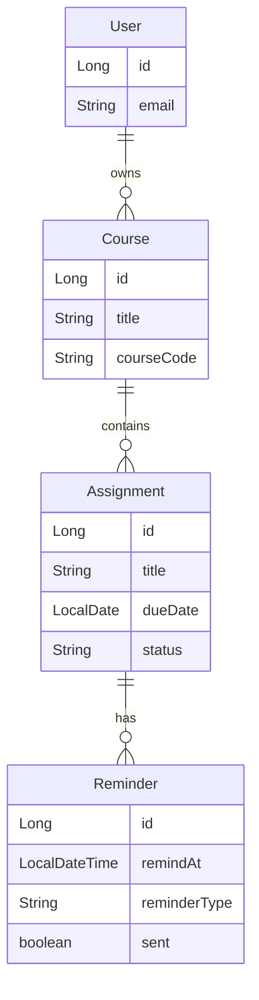
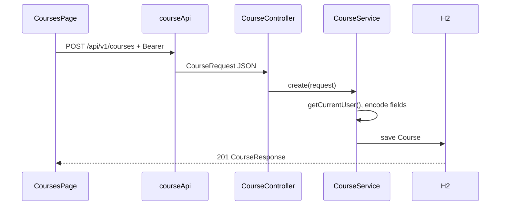
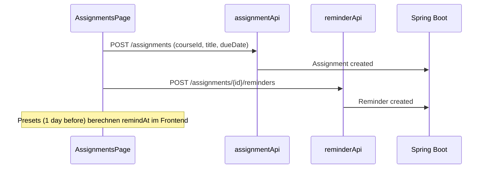
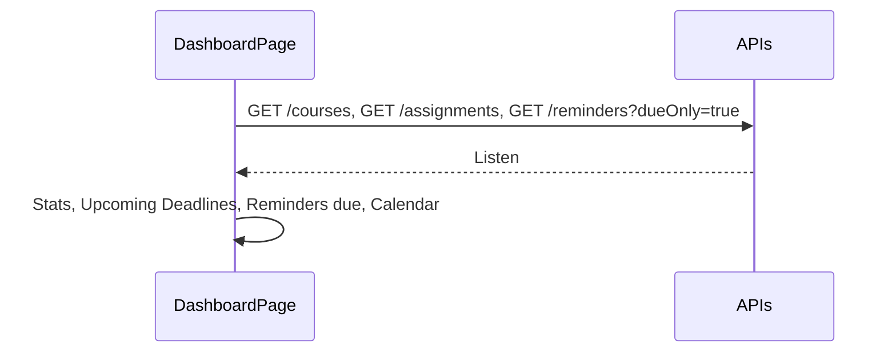

# Meilenstein 2: Basisfunktionen — Umsetzung & Ablauf

Dieses Dokument beschreibt die **Umsetzung von Meilenstein 2** in StudyBridge: zusätzliche Domänenentitäten mit **vollständigem CRUD** auf **REST-Backend** und **React-Frontend**, inklusive **Dashboard** mit Live-Daten. Es baut auf [MILESTONE1_AUTHENTICATION.md](MILESTONE1_AUTHENTICATION.md) auf.

---

## 1. Anforderungen aus der Aufgabenstellung (1er-Team)

| Nr. | Anforderung | Umsetzung in StudyBridge |
|-----|-------------|--------------------------|
| M1 | Authentifizierung (Basic → JWT, BCrypt) | Siehe Meilenstein-1-Dokument |
| M2a | **Zwei weitere Entitäten** (zusätzlich zu User) | **Course**, **Assignment** |
| M2b | **CRUD** je Entität auf Server **und** Client | REST-Controller + React-Seiten/Modals |
| M2c | Client und Server arbeiten zusammen | Axios + JWT; keine isolierte Nutzung |
| Extra (Projektspezifikation) | Dashboard, Erinnerungen | **Dashboard** mit API-Daten; **Reminder** als 4. Entität (Assignment → Reminder) |

**Hinweis:** Für die **formale** Meilenstein-2-Abgabe (1er-Team) zählen typischerweise **User + 2 Entitäten mit CRUD**. **Reminder** ist in der Projektspezifikation vorgesehen und hier vollständig umgesetzt — ein Plus für die Abnahme, aber klar von **Course/Assignment** getrennt benennen.

**Noch nicht umgesetzt (Meilenstein 3 / finale Abgabe):** Document, Translation, vollständige Kalenderseite, Landing Page, E-Mail-Benachrichtigungen, PostgreSQL-Produktions-DB.

---

## 2. Domänenmodell & Beziehungen

Entitäten gemäß Projektspezifikation (Auszug):

| Entität | Attribute (Implementierung) | Besitzer / Bezug |
|---------|----------------------------|------------------|
| **User** | id, name, email, passwordHash, preferredLanguage, role, enabled, createdAt | — |
| **Course** | id, title, courseCode, semester, instructor (optional), createdAt | `user_id` → User |
| **Assignment** | id, title, description (optional), dueDate, status (PENDING/COMPLETED), createdAt | `course_id` → Course |
| **Reminder** | id, remindAt, reminderType, sent (isSent), assignment_id | `assignment_id` → Assignment |



**Löschkaskade:** Assignment löschen → Reminder mitgelöscht (`ON DELETE CASCADE`). Course löschen → Assignments (und deren Reminder) mitgelöscht.

---

## 3. Sicherheit & Datenzugriff

- Alle Endpunkte unter `/api/v1/**` (außer Auth/H2) erfordern **JWT** (Meilenstein 1).
- **Kein User** kann Kurse, Aufgaben oder Erinnerungen eines anderen Users lesen oder ändern.
- Technisch: Abfragen filtern über `course.user.id` bzw. `assignment.course.user.id` (Spring-Data-Methoden wie `findByIdAndUserId`, `findByIdAndCourse_User_Id`).

---

## 4. REST-API-Übersicht

Basis-URL: `http://localhost:8080` — Header für geschützte Routen: `Authorization: Bearer <accessToken>`.

### 4.1 Courses — `/api/v1/courses`

| Methode | Pfad | Beschreibung |
|---------|------|--------------|
| `GET` | `/api/v1/courses` | Alle Kurse des eingeloggten Users |
| `GET` | `/api/v1/courses/{id}` | Ein Kurs |
| `POST` | `/api/v1/courses` | Anlegen → `201` |
| `PUT` | `/api/v1/courses/{id}` | Aktualisieren |
| `DELETE` | `/api/v1/courses/{id}` | Löschen → `204` |

**Request-Body (POST/PUT):**

```json
{
  "title": "Enterprise Web Development",
  "courseCode": "EWD",
  "semester": "SS 2026",
  "instructor": "Prof. von Klinski"
}
```

`instructor` ist **optional** (leer oder weggelassen → `null` in der DB).

**Response:** `id`, `title`, `courseCode`, `semester`, `instructor`, `createdAt`.

---

### 4.2 Assignments — `/api/v1/assignments`

| Methode | Pfad | Beschreibung |
|---------|------|--------------|
| `GET` | `/api/v1/assignments` | Alle Aufgaben des Users (optional `?status=PENDING` oder `COMPLETED`) |
| `GET` | `/api/v1/assignments/{id}` | Eine Aufgabe |
| `POST` | `/api/v1/assignments` | Anlegen → `201` |
| `PUT` | `/api/v1/assignments/{id}` | Aktualisieren |
| `PATCH` | `/api/v1/assignments/{id}/status` | Status setzen (Body: `{ "status": "COMPLETED" }`) |
| `DELETE` | `/api/v1/assignments/{id}` | Löschen → `204` |

**Request-Body (POST/PUT):**

```json
{
  "courseId": 1,
  "title": "Essay draft",
  "description": "Optional notes",
  "dueDate": "2026-06-15",
  "status": "PENDING"
}
```

`description` optional; `status` optional beim Anlegen (Default: `PENDING`).

**Response:** u. a. `courseId`, `courseCode`, `courseTitle`, `title`, `description`, `dueDate`, `status`, `createdAt`.

---

### 4.3 Reminders — `/api/v1/reminders` und verschachtelt

| Methode | Pfad | Beschreibung |
|---------|------|--------------|
| `GET` | `/api/v1/reminders` | Alle Erinnerungen des Users |
| `GET` | `/api/v1/reminders?dueOnly=true` | Fällig & nicht dismissed (`remindAt` ≤ jetzt, `sent=false`) |
| `GET` | `/api/v1/reminders/{id}` | Eine Erinnerung |
| `GET` | `/api/v1/assignments/{assignmentId}/reminders` | Erinnerungen zu einer Aufgabe |
| `POST` | `/api/v1/assignments/{assignmentId}/reminders` | Anlegen → `201` |
| `PUT` | `/api/v1/reminders/{id}` | Aktualisieren |
| `PATCH` | `/api/v1/reminders/{id}/sent?sent=true` | Als „gesendet/dismissed“ markieren |
| `DELETE` | `/api/v1/reminders/{id}` | Löschen → `204` |

**Request-Body (POST/PUT):**

```json
{
  "remindAt": "2026-11-30T09:00:00",
  "reminderType": "ONE_DAY_BEFORE"
}
```

**reminderType:** `ONE_DAY_BEFORE`, `THREE_DAYS_BEFORE`, `ONE_WEEK_BEFORE`, `CUSTOM`.

**Benachrichtigung:** Aktuell **in-app** (Dashboard-Banner „Reminders due“ + Dismiss). Kein E-Mail-Versand (geplant für spätere Iteration / externes System).

---

## 5. Frontend — Struktur & Routen

### 5.1 App-Shell (Phase 0)

- `AppLayout` mit Sidebar: Dashboard, Courses, Documents (Platzhalter), Assignments, Calendar (Platzhalter)
- Sign out unten in der Sidebar
- Responsive: Hamburger-Menü auf kleinen Viewports

### 5.2 Implementierte Seiten (Meilenstein 2)

| Route | Komponente | Funktion |
|-------|------------|----------|
| `/dashboard` | `DashboardPage` | Statistik-Karten, fällige Erinnerungen, anstehende Aufgaben, Kurse, Kalender-Widget (Assignments) |
| `/courses` | `CoursesPage` | Kurskarten, CRUD per Modal |
| `/assignments` | `AssignmentsPage` | Liste mit Filter (All/Pending/Completed), CRUD, Status-Toggle, **Reminder-Bereich** pro Aufgabe |
| `/documents`, `/calendar` | `PlaceholderPage` | Meilenstein 3 |

### 5.3 API-Clients (Frontend)

| Datei | Zuständigkeit |
|-------|----------------|
| `frontend/src/api/courseApi.ts` | Course CRUD |
| `frontend/src/api/assignmentApi.ts` | Assignment CRUD + Status |
| `frontend/src/api/reminderApi.ts` | Reminder CRUD + dueOnly + sent |

JWT wird zentral über `setBearerToken` in `frontend/src/api/client.ts` gesetzt (nach Login in `AuthContext`).

---

## 6. Workflows (Auszug)

### 6.1 Kurs anlegen



### 6.2 Aufgabe mit Erinnerung



### 6.3 Dashboard lädt Live-Daten



---

## 7. Relevante Dateien (Referenz)

### Backend

| Thema | Datei(en) |
|-------|-----------|
| Course | `model/Course.java`, `repository/CourseRepository.java`, `service/CourseService.java`, `controller/CourseController.java`, `dto/CourseRequest.java`, `dto/CourseResponse.java` |
| Assignment | `model/Assignment.java`, `model/AssignmentStatus.java`, `repository/AssignmentRepository.java`, `service/AssignmentService.java`, `controller/AssignmentController.java`, `dto/AssignmentRequest.java`, `dto/AssignmentResponse.java` |
| Reminder | `model/Reminder.java`, `model/ReminderType.java`, `repository/ReminderRepository.java`, `service/ReminderService.java`, `controller/ReminderController.java`, `dto/ReminderRequest.java`, `dto/ReminderResponse.java` |
| Security | `config/SecurityConfig.java`, `security/JwtAuthenticationFilter.java` (unverändert M1) |

### Frontend

| Thema | Datei(en) |
|-------|-----------|
| Layout | `layouts/AppLayout.tsx` |
| Seiten | `pages/DashboardPage.tsx`, `pages/CoursesPage.tsx`, `pages/AssignmentsPage.tsx` |
| Modals | `components/CourseFormModal.tsx`, `components/AssignmentFormModal.tsx`, `components/ReminderFormModal.tsx` |
| Reminder UI | `components/AssignmentReminders.tsx`, `utils/reminderPresets.ts` |
| UI-Bausteine | `components/ui/Card.tsx`, `components/Calendar.tsx` |

### Tests (Backend)

| Test | Prüft |
|------|--------|
| `AuthFlowIntegrationTest` | M1 Auth |
| `CourseCrudIntegrationTest` | Course CRUD inkl. optional instructor |
| `AssignmentCrudIntegrationTest` | Assignment CRUD + Status |
| `ReminderCrudIntegrationTest` | Reminder CRUD + sent |

Ausführen: `cd backend && mvn test`

---

## 8. Manuelle Test-Checkliste (Abnahme)

1. Einloggen (M1).
2. **Kurs** anlegen, bearbeiten, löschen — ohne und mit Instructor.
3. **Aufgabe** anlegen (Kurs wählen), als erledigt markieren, bearbeiten, löschen.
4. **Erinnerung** an Aufgabe hängen (Preset + Custom), auf Dashboard „Reminders due“ prüfen (Custom-Zeit in der Vergangenheit zum Testen), **Dismiss**.
5. **Dashboard:** Kursanzahl, offene/erledigte Aufgaben, anstehende Fristen, Kalender-Punkte stimmen mit Daten überein.
6. Abmelden → geschützte URLs leiten zu Login um.
7. `curl` ohne Token auf `/api/v1/courses` → `401`.

---

## 9. Kurzantwort für die Einreichung / Abnahme

StudyBridge erfüllt **Meilenstein 2** für ein Einzelprojekt wie folgt:

1. **Meilenstein 1** bleibt gültig: Basic-Login, JWT, BCrypt, React ↔ Spring Boot.
2. **Zwei Kernentitäten mit CRUD:** **Course** und **Assignment** — jeweils REST + UI.
3. **Dashboard** zeigt echte Daten aus der API (Kurse, Aufgaben, Erinnerungen, Kalender-Widget).
4. **Reminder** ergänzt die Projektspezifikation (Fristen-Erinnerungen, in-app).
5. **Architektur:** Schichtenmodell (Controller → Service → Repository → JPA), user-scoped Zugriff, Integrationstests.

---

## 10. Hinweise für Meilenstein 3

- **Document** + Datei-Upload + **Translation** (externer Dienst nur über Backend)
- **Kalenderseite** (`/calendar`) mit Assignment-Daten
- **Landing Page**, Responsiveness verfeinern, ggf. **PostgreSQL**
- Optional: E-Mail bei fälligen Remindern (Scheduler + SMTP)

---

*Stand: StudyBridge-Codebase. Bei API- oder UI-Änderungen dieses Dokument mitpflegen.*
