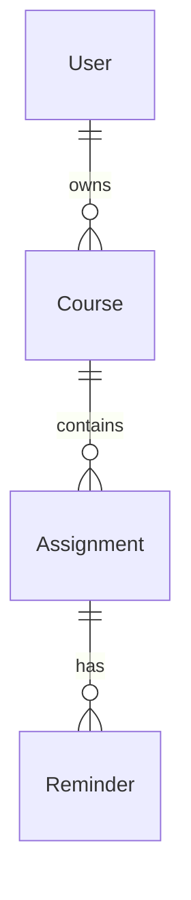

# Milestone 2: Base features — implementation and flow

> German edition (for coursework / professor): [MILESTONE2_BASE_FEATURES.md](MILESTONE2_BASE_FEATURES.md)  
> Builds on: [MILESTONE1_AUTHENTICATION_EN.md](MILESTONE1_AUTHENTICATION_EN.md)

This document describes **Milestone 2** in StudyBridge: additional domain entities with **full CRUD** on the **REST backend** and **React frontend**, including a **dashboard** fed by live API data.

---

## 1. Assignment requirements (solo team)

| # | Requirement | StudyBridge implementation |
|---|-------------|---------------------------|
| M1 | Authentication (Basic → JWT, BCrypt) | See Milestone 1 doc |
| M2a | **Two more entities** (besides User) | **Course**, **Assignment** |
| M2b | **CRUD** per entity on server **and** client | REST controllers + React pages/modals |
| M2c | Client and server work together | Axios + JWT; not usable in isolation |
| Extra (project spec) | Dashboard, reminders | **Dashboard** with API data; **Reminder** entity (Assignment → Reminder) |

**Note:** For formal **Milestone 2** (solo), grading typically expects **User + 2 entities with CRUD**. **Reminder** is from your project specification and is fully implemented — present it as an addition beyond Course/Assignment.

**Not yet implemented (Milestone 3 / final):** Document, Translation, full calendar page, landing page, email notifications, production PostgreSQL.

---

## 2. Domain model and relationships

| Entity | Attributes (implementation) | Owner / link |
|--------|----------------------------|--------------|
| **User** | id, name, email, passwordHash, preferredLanguage, role, enabled, createdAt | — |
| **Course** | id, title, courseCode, semester, instructor (optional), createdAt | `user_id` → User |
| **Assignment** | id, title, description (optional), dueDate, status (PENDING/COMPLETED), createdAt | `course_id` → Course |
| **Reminder** | id, remindAt, reminderType, sent, assignment_id | `assignment_id` → Assignment |



**Delete cascade:** Deleting a course removes its assignments and their reminders. Deleting an assignment removes its reminders.

---

## 3. Security and data access

- All `/api/v1/**` routes except auth/H2 require **JWT** (Milestone 1).
- Users cannot access another user's courses, assignments, or reminders.
- Queries filter by the logged-in user's id via JPA repository method names (`findByIdAndUserId`, `findByIdAndCourse_User_Id`, etc.).

---

## 4. REST API overview

Base URL: `http://localhost:8080` — protected routes: `Authorization: Bearer <accessToken>`.

### 4.1 Courses — `/api/v1/courses`

| Method | Path | Description |
|--------|------|-------------|
| `GET` | `/api/v1/courses` | List current user's courses |
| `GET` | `/api/v1/courses/{id}` | Get one |
| `POST` | `/api/v1/courses` | Create → `201` |
| `PUT` | `/api/v1/courses/{id}` | Update |
| `DELETE` | `/api/v1/courses/{id}` | Delete → `204` |

**Request body (POST/PUT):**

```json
{
  "title": "Enterprise Web Development",
  "courseCode": "EWD",
  "semester": "SS 2026",
  "instructor": "Prof. von Klinski"
}
```

`instructor` is **optional**.

---

### 4.2 Assignments — `/api/v1/assignments`

| Method | Path | Description |
|--------|------|-------------|
| `GET` | `/api/v1/assignments` | List all (optional `?status=PENDING` or `COMPLETED`) |
| `GET` | `/api/v1/assignments/{id}` | Get one |
| `POST` | `/api/v1/assignments` | Create → `201` |
| `PUT` | `/api/v1/assignments/{id}` | Update |
| `PATCH` | `/api/v1/assignments/{id}/status` | Set status `{ "status": "COMPLETED" }` |
| `DELETE` | `/api/v1/assignments/{id}` | Delete → `204` |

**Request body (POST/PUT):**

```json
{
  "courseId": 1,
  "title": "Essay draft",
  "description": "Optional notes",
  "dueDate": "2026-06-15"
}
```

---

### 4.3 Reminders

| Method | Path | Description |
|--------|------|-------------|
| `GET` | `/api/v1/reminders` | All for user |
| `GET` | `/api/v1/reminders?dueOnly=true` | Due and not dismissed |
| `GET` | `/api/v1/assignments/{assignmentId}/reminders` | Per assignment |
| `POST` | `/api/v1/assignments/{assignmentId}/reminders` | Create |
| `PUT` | `/api/v1/reminders/{id}` | Update |
| `PATCH` | `/api/v1/reminders/{id}/sent?sent=true` | Dismiss |
| `DELETE` | `/api/v1/reminders/{id}` | Delete |

**reminderType:** `ONE_DAY_BEFORE`, `THREE_DAYS_BEFORE`, `ONE_WEEK_BEFORE`, `CUSTOM`.

**Notifications:** In-app only (dashboard banner + dismiss). No email yet.

---

## 5. Frontend structure

### Routes (implemented)

| Route | Page | Features |
|-------|------|----------|
| `/dashboard` | `DashboardPage` | Stats, due reminders, upcoming assignments, courses, calendar widget |
| `/courses` | `CoursesPage` | Card grid, CRUD modal |
| `/assignments` | `AssignmentsPage` | Filters, CRUD, complete toggle, reminders per assignment |
| `/documents`, `/calendar` | Placeholder | Milestone 3 |

### API clients

- `frontend/src/api/courseApi.ts`
- `frontend/src/api/assignmentApi.ts`
- `frontend/src/api/reminderApi.ts`

JWT via `setBearerToken` in `frontend/src/api/client.ts` after login.

---

## 6. Key files

### Backend

| Topic | Files |
|-------|--------|
| Course | `model/Course.java`, `service/CourseService.java`, `controller/CourseController.java`, … |
| Assignment | `model/Assignment.java`, `service/AssignmentService.java`, `controller/AssignmentController.java`, … |
| Reminder | `model/Reminder.java`, `service/ReminderService.java`, `controller/ReminderController.java`, … |

### Frontend

| Topic | Files |
|-------|--------|
| Layout | `layouts/AppLayout.tsx` |
| Pages | `pages/DashboardPage.tsx`, `pages/CoursesPage.tsx`, `pages/AssignmentsPage.tsx` |
| Components | `CourseFormModal.tsx`, `AssignmentFormModal.tsx`, `ReminderFormModal.tsx`, `AssignmentReminders.tsx` |

### Tests

`CourseCrudIntegrationTest`, `AssignmentCrudIntegrationTest`, `ReminderCrudIntegrationTest`, plus `AuthFlowIntegrationTest`.

Run: `cd backend && mvn test`

---

## 7. Manual test checklist

1. Log in (M1).
2. Create, edit, delete a **course** (with and without instructor).
3. Create **assignment**, mark complete, edit, delete.
4. Add **reminder** (preset + custom); test dashboard “Reminders due” (custom time in the past); dismiss.
5. Verify **dashboard** counts and lists match data.
6. Log out → protected routes redirect to login.
7. API without token → `401`.

---

## 8. Submission summary

StudyBridge satisfies Milestone 2 for a solo project:

1. **Milestone 1** intact: Basic login, JWT, BCrypt, full stack auth.
2. **Two CRUD entities:** **Course** and **Assignment** on REST + React.
3. **Dashboard** uses real API data.
4. **Reminder** implements the project spec (in-app notifications).
5. Layered architecture, user-scoped access, integration tests.

---

## 9. Planned for Milestone 3

Document upload, Translation via backend-only external API, full calendar page, landing page, PostgreSQL, optional email reminders.

---

*Based on the StudyBridge repository. Update when APIs or UI change.*
