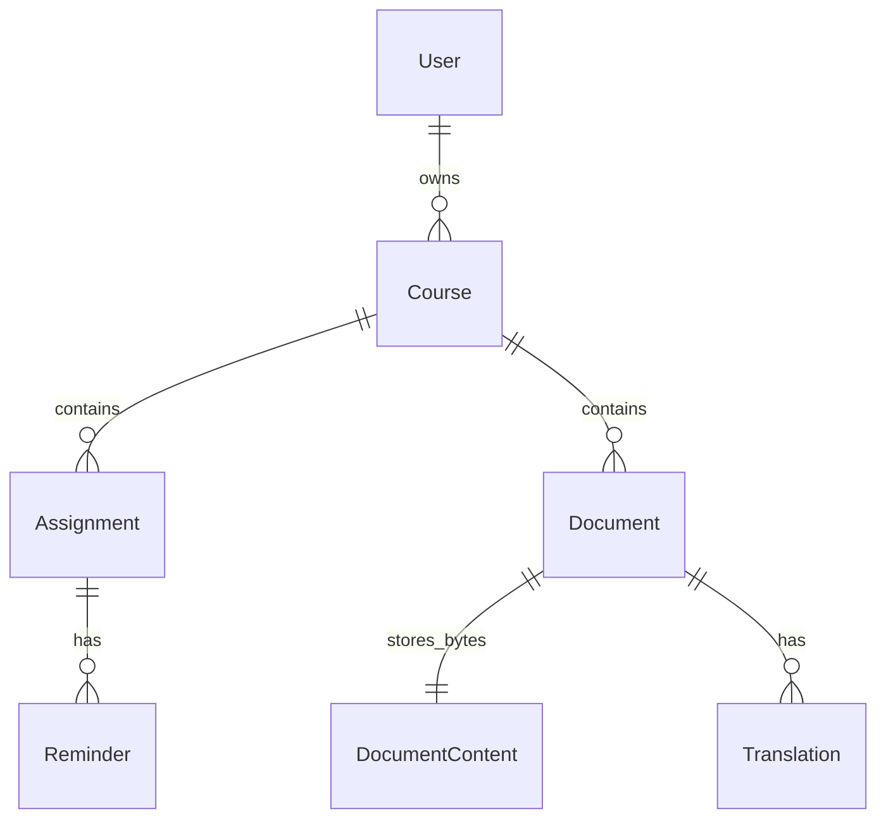
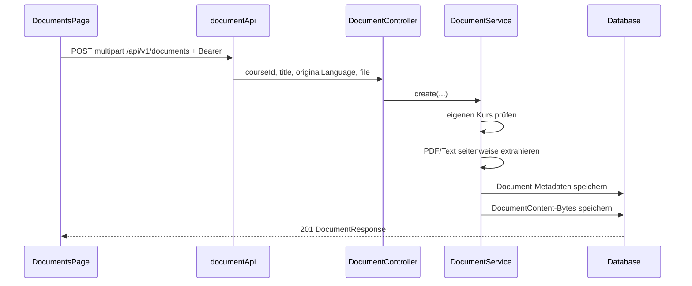
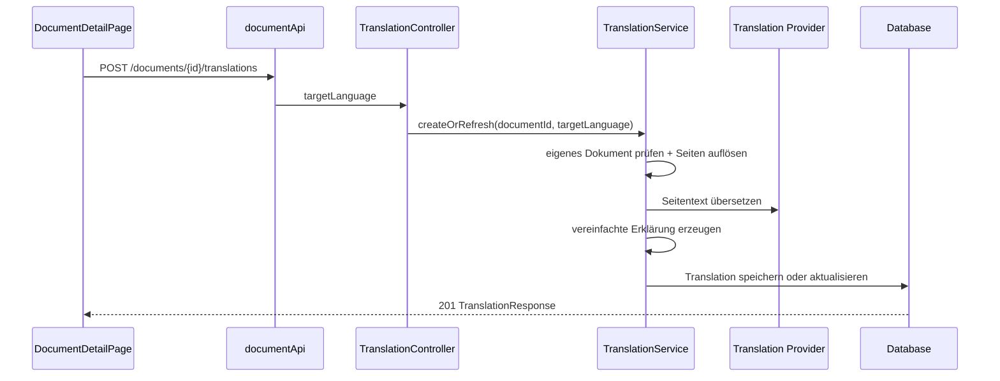
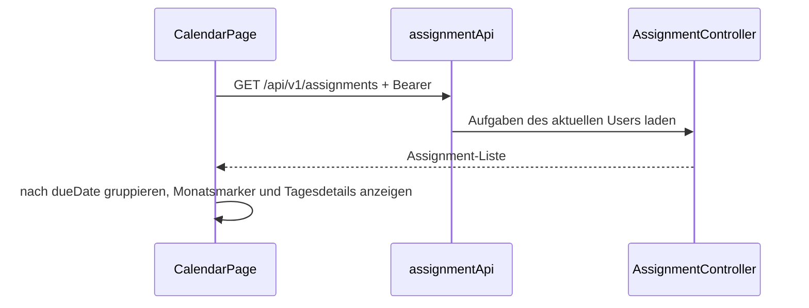
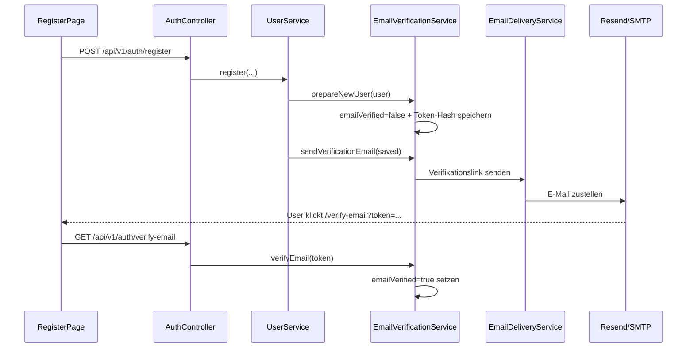
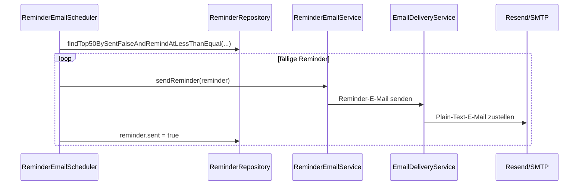

# Meilenstein 3: Finale Anwendung — Umsetzung & Ablauf

> Englische Version: [MILESTONE3_FINAL_EN.md](MILESTONE3_FINAL_EN.md)  
> Baut auf: [MILESTONE1_AUTHENTICATION.md](MILESTONE1_AUTHENTICATION.md), [MILESTONE2_BASE_FEATURES.md](MILESTONE2_BASE_FEATURES.md)

Dieses Dokument beschreibt die **Umsetzung von Meilenstein 3 / finaler Abgabe** in StudyBridge. Die bereits vorhandene Authentifizierung, Kurse, Aufgaben, Erinnerungen und das Dashboard wurden zur vollständigen Anwendung erweitert: **Dokument-Upload**, **PDF-/Text-Extraktion**, **Übersetzung nur über das Backend**, **Side-by-Side-Dokumentansicht**, **vollständige Kalenderseite**, **Landing Page**, **Admin-Benutzerverwaltung**, **E-Mail-Verifikation**, **Deployment-Konfiguration** und **Resend-/SMTP-E-Mail-Erinnerungen**.

---

## 1. Anforderungen aus Aufgabenstellung und StudyBridge-Umfang

Das Übungsblatt beschreibt Meilenstein 3 als **vollständige finale Anwendung**. Zusätzlich werden Zusammenspiel von REST-Server und Client, Qualität, Sicherheit, Konfiguration, Responsiveness und professionelle Umsetzung betont.

| Anforderung / Qualitätsaspekt | Umsetzung in StudyBridge |
|-------------------------------|--------------------------|
| Vollständige finale Anwendung | Auth, Dashboard, Courses, Assignments, Reminders, Documents, Translations, Calendar, Landing Page, Admin-Bereich |
| Client und REST-Server arbeiten zusammen | React-Seiten rufen Spring-Boot-REST-Endpunkte per Axios + JWT auf |
| Professionelles, responsives UI | App-Shell, Loading States, Error Alerts, Suche/Filter, responsive Seiten |
| Sicherheit und Autorisierung | JWT für `/api/v1/**`; user-scoped Zugriff auf Kurse, Aufgaben, Erinnerungen, Dokumente, Übersetzungen; Admin-only Benutzerverwaltung |
| Konfiguration / Umgebungsvariablen | JWT, CORS, Translation Provider, DeepL/MyMemory, Resend/SMTP-E-Mail, PostgreSQL-Profil, Render-Deployment über Properties/Env Vars |
| Externe Dienste nur über Backend | Übersetzungsanbieter wird nur vom Spring-Boot-Backend aufgerufen, nie direkt aus React |
| Fehlermanagement | Zentraler Backend-Exception-Handler + Frontend `ErrorAlert` / API-Fehlermapping |
| Produktionspersistenz | `prod`-Profil für PostgreSQL; `dev` bleibt H2 |
| Finale E-Mail-Funktionen | E-Mail-Verifikation und Erinnerungs-E-Mails über gemeinsamen Delivery-Service; Resend HTTP für Render, SMTP weiterhin unterstützt |

**Hinweis zum Umfang:** Meilenstein 1 und 2 bleiben gültig und werden hier nicht vollständig wiederholt. Dieses Dokument fokussiert die Ergänzungen aus Meilenstein 3.

---

## 2. Finales Domänenmodell

| Entität | Attribute (Implementierung) | Besitzer / Bezug |
|---------|-----------------------------|------------------|
| **User** | id, name, email, passwordHash, preferredLanguage, role, enabled, emailVerified, emailVerificationTokenHash, emailVerificationExpiresAt, createdAt | — |
| **Course** | id, title, courseCode, semester, instructor, createdAt | `user_id` → User |
| **Assignment** | id, title, description, dueDate, status, createdAt | `course_id` → Course |
| **Reminder** | id, remindAt, reminderType, sent | `assignment_id` → Assignment |
| **Document** | id, title, originalFilename, contentType, fileSize, originalLanguage, extractedText, pageTexts, uploadDate | `course_id` → Course |
| **DocumentContent** | documentId, data | gleicher Primary Key wie Document |
| **Translation** | id, targetLanguage, translatedText, translatedPages, simplifiedText, simplifiedPages, createdAt | `document_id` → Document |



**Löschverhalten:** Kursbezogene Entitäten nutzen dort Datenbank-Löschregeln, wo sie konfiguriert sind (`@OnDelete`). Wird ein Dokument über `DocumentService.delete(...)` gelöscht, werden sowohl Metadaten als auch gespeicherte `DocumentContent`-Bytes entfernt.

**Warum `DocumentContent` separat ist:** Metadaten liegen getrennt von den rohen Datei-Bytes, damit Listen- und Detailabfragen keine großen Dateien laden. Die Datei bleibt trotzdem in der Datenbank persistent, was bei Deployments mit flüchtigem Dateisystem robuster ist.

---

## 3. Sicherheit & Datenzugriff

- Geschützte Routen verwenden `Authorization: Bearer <accessToken>`.
- Registrierung kann E-Mail-Verifikation erzwingen. Nicht verifizierte Benutzer können sich erst einloggen, wenn `/api/v1/auth/verify-email` den Token akzeptiert.
- Admin-Zugriff wird über konfigurierte `ADMIN_EMAILS` vergeben; Admin-Routen benötigen `ROLE_ADMIN`.
- Admins können Benutzer auflisten, aktivieren/deaktivieren und andere Benutzer löschen. Deaktivierte Accounts können sich nicht einloggen und vorhandene JWTs werden abgelehnt.
- Zugriff auf Dokumente und Übersetzungen ist über den Kursbesitzer eingeschränkt (`document.course.user.id`).
- Uploads werden erst nach `CourseService.findOwnedCourseEntity(courseId)` einem Kurs zugeordnet.
- Übersetzung läuft über `/api/v1/documents/{documentId}/translations`; Provider-Credentials gelangen nicht ins Frontend.
- DeepL-API-Key, MyMemory-E-Mail, Resend-API-Key, SMTP-Credentials, Datenbank-Credentials und JWT-Secret werden über Umgebungsvariablen konfiguriert.

---

## 4. REST-API-Ergänzungen

Basis-URL: `http://localhost:8080` — geschützte Routen benötigen JWT.

### 4.1 Documents — `/api/v1/documents`

| Methode | Pfad | Beschreibung |
|---------|------|--------------|
| `GET` | `/api/v1/documents` | Dokumente des eingeloggten Users |
| `GET` | `/api/v1/documents?courseId=1` | Dokumente eines eigenen Kurses |
| `GET` | `/api/v1/documents?search=essay` | Suche nach Dokumenttitel |
| `GET` | `/api/v1/documents/{id}` | Dokument-Metadaten + extrahierter Text/Seiten |
| `POST` | `/api/v1/documents` | Upload per `multipart/form-data` → `201` |
| `GET` | `/api/v1/documents/{id}/download` | Originaldatei herunterladen |
| `DELETE` | `/api/v1/documents/{id}` | Dokument löschen → `204` |

**Upload-Formfelder:**

| Feld | Typ | Bedeutung |
|------|-----|-----------|
| `courseId` | number | Eigener Kurs |
| `title` | string | Anzeigename |
| `originalLanguage` | string | Ausgangssprache, z. B. `German` |
| `file` | file | PDF oder textähnliche Datei |

**Extraktionsverhalten:**

- PDFs werden mit **Apache PDFBox** seitenweise ausgelesen.
- Textähnliche Dateien (`.txt`, `.md`, `.csv`, `.json`, `.xml`, `.html`, `.css`, `.java`, `.properties`, `.sql`, `.ts`, `.tsx`, `.yaml`, `.yml`) werden als eine Textseite gespeichert.
- `extractedText` ist der zusammengeführte Text; `pageTexts` erhält die Seitenausrichtung für die Side-by-Side-Ansicht.

---

### 4.2 Translations — `/api/v1/documents/{documentId}/translations`

| Methode | Pfad | Beschreibung |
|---------|------|--------------|
| `GET` | `/api/v1/documents/{documentId}/translations` | Übersetzungen eines eigenen Dokuments |
| `POST` | `/api/v1/documents/{documentId}/translations` | Übersetzung für Zielsprache erzeugen oder aktualisieren → `201` |

**Request-Body:**

```json
{
  "targetLanguage": "English"
}
```

**Response enthält:**

- `translatedText` und `translatedPages`
- `simplifiedText` und `simplifiedPages`
- `targetLanguage`, `documentId`, `createdAt`

**Provider-Verhalten:**

- Standard-Provider: `deepl`
- Alternativen: `mymemory`, `local`
- DeepL-Free-Keys mit Endung `:fx` werden automatisch zu `https://api-free.deepl.com` geroutet; Pro-Keys zu `https://api.deepl.com`.
- MyMemory teilt längere Texte in kleinere Requests und kann optional eine Kontakt-E-Mail mitsenden.
- `local` ist für Offline-Demos/Tests vorhanden und gibt einen markierten lokalen Entwurf zurück.

---

### 4.3 Auth-Ergänzungen — `/api/v1/auth`

Die Authentifizierung aus Meilenstein 1 bleibt bestehen. Die finale Version ergänzt E-Mail-Verifikation:

| Methode | Pfad | Beschreibung |
|---------|------|--------------|
| `POST` | `/api/v1/auth/register` | Erstellt einen Benutzer. Wenn Verifikation aktiv ist, enthält die Response `emailVerified=false` und eine Verifikations-E-Mail wird versendet. |
| `GET` | `/api/v1/auth/login` | Basic-Auth-Login. Gibt JWT nur für aktive und verifizierte Benutzer zurück. |
| `GET` | `/api/v1/auth/verify-email?token=...` | Verifiziert den E-Mail-Token und erlaubt danach den Login. |
| `POST` | `/api/v1/auth/resend-verification` | Sendet eine neue Verifikations-E-Mail für einen unverifizierten Account. |

Bestehende Benutzer werden als verifiziert behandelt, wenn die nullable Datenbankspalte keinen Wert hat. Dadurch sperrt das Aktivieren der Verifikation bestehende Accounts nicht aus.

### 4.4 Admin-Benutzerverwaltung — `/api/v1/admin/users`

Die Admin-Funktionalität ist durch `ROLE_ADMIN` geschützt. Ein Benutzer wird Admin, wenn seine E-Mail-Adresse in `ADMIN_EMAILS` konfiguriert ist.

| Methode | Pfad | Beschreibung |
|---------|------|--------------|
| `GET` | `/api/v1/admin/users` | Alle Benutzer absteigend nach Erstellungsdatum auflisten |
| `PATCH` | `/api/v1/admin/users/{id}/enabled` | Benutzerkonto aktivieren oder deaktivieren |
| `DELETE` | `/api/v1/admin/users/{id}` | Anderen Benutzer und dessen Kurs-/Dokumentdaten löschen |

Admins können ihren eigenen Account nicht deaktivieren oder löschen.

---

## 5. E-Mail-Verifikation und E-Mail-Erinnerungen

Meilenstein 2 hatte In-App-Erinnerungen. Meilenstein 3 ergänzt **E-Mail-Versand** für Account-Verifikation und Reminder-Benachrichtigungen:

| Komponente | Verhalten |
|------------|-----------|
| `EmailDeliveryService` | Gemeinsamer Versand über Resend HTTP API oder SMTP |
| `EmailVerificationService` | Erzeugt sichere Tokens, speichert Token-Hashes, versendet Verifikationslinks, verifiziert Accounts |
| `ReminderEmailService` | Baut Reminder-E-Mails für fällige Aufgaben |
| `ReminderEmailScheduler` | Pollt fällige, ungesendete Reminder, sendet bis zu 50 und markiert erfolgreiche als `sent` |
| Feature Flags | Verifikation und Reminder können getrennt aktiviert werden |

Relevante Konfiguration:

```properties
app.email-verification.enabled=${EMAIL_VERIFICATION_ENABLED:false}
app.email-verification.provider=${EMAIL_VERIFICATION_PROVIDER:smtp}
app.email-verification.from=${EMAIL_VERIFICATION_FROM:${app.email.default-from}}
app.email-verification.token-expiration-hours=${EMAIL_VERIFICATION_TOKEN_EXPIRATION_HOURS:24}
app.email.resend.api-key=${RESEND_API_KEY:}

app.reminders.email.enabled=${REMINDER_EMAIL_ENABLED:false}
app.reminders.email.provider=${REMINDER_EMAIL_PROVIDER:${app.email-verification.provider}}
app.reminders.email.from=${REMINDER_EMAIL_FROM:${app.email-verification.from}}
app.reminders.email.poll-ms=${REMINDER_EMAIL_POLL_MS:60000}

spring.mail.host=${MAIL_HOST:localhost}
spring.mail.port=${MAIL_PORT:587}
spring.mail.username=${MAIL_USERNAME:}
spring.mail.password=${MAIL_PASSWORD:}
```

Für lokale Entwicklung bleibt SMTP verfügbar. Für Render ist Resend HTTP der robustere Produktionsdefault, weil direkte SMTP-Verbindungen auf Hosting-Plattformen timeouts verursachen können. Wenn der Reminder-Versand fehlschlägt, schreibt der Scheduler eine Warnung und lässt den Reminder ungesendet, damit ein späterer Retry möglich bleibt.

---

## 6. Frontend — Struktur & Routen

### Routen

| Route | Seite | Funktionen |
|-------|-------|------------|
| `/` | `LandingPage` | Öffentliche Produktseite, Sprache/Theme, Login/Register-CTAs |
| `/dashboard` | `DashboardPage` | Kennzahlen, fällige Reminder, anstehende Aufgaben, Kurse, Kalender-Widget, Dokumentanzahl |
| `/courses` | `CoursesPage` | Course CRUD |
| `/assignments` | `AssignmentsPage` | Assignment CRUD, Status-Toggle, Reminder UI |
| `/documents` | `DocumentsPage` | Upload, Liste, Suche, Kursfilter, Download, Löschen |
| `/documents/:id` | `DocumentDetailPage` | PDF-/Textansicht, Übersetzung erzeugen, Übersetzung/vereinfachte Erklärung rechts |
| `/calendar` | `CalendarPage` | Monatsnavigation, Assignment-Markierungen, Tagesdetails, Statuszahlen |
| `/admin/users` | `AdminUsersPage` | Admin-only Benutzerliste mit Aktivieren/Deaktivieren und Löschen |
| `/verify-email` | `VerifyEmailPage` | Verarbeitet Verifikationslinks aus E-Mails |
| `/login`, `/register` | Auth-Seiten | Basic Login → JWT, Registrierung |

### API-Clients

| Datei | Zuständigkeit |
|-------|---------------|
| `frontend/src/api/documentApi.ts` | Dokument-Upload/Liste/Detail/Download/Löschen + Übersetzungsrequests |
| `frontend/src/api/assignmentApi.ts` | Datenquelle für vollständige Kalenderseite |
| `frontend/src/api/adminUserApi.ts` | Admin-Benutzerliste, Aktivieren/Deaktivieren, Löschen |
| `frontend/src/api/authApi.ts` | Registrierung, Basic Login, E-Mail-Verifikation, Verifikation erneut senden |
| `frontend/src/api/client.ts` | Gemeinsame Axios-Instanz und Bearer-Token |

### Dokument-Detailansicht

- Nutzt `react-pdf` / `pdfjs-dist`, um authentifizierte PDF-Bytes vom Backend zu rendern.
- Original-PDF oder Text steht links; Übersetzung oder vereinfachte Erklärung rechts.
- Seitenausrichtung bleibt durch `pageTexts`, `translatedPages` und `simplifiedPages` erhalten.
- Nicht-PDF-Dokumente werden über den extrahierten Text angezeigt.

---

## 7. Konfiguration & Deployment-Profile

### Development-Profil

`application-dev.properties`

- H2 In-Memory-Datenbank
- H2 Console aktiviert
- `ddl-auto=create-drop`
- SQL-Logging aktiviert

### Production-Profil

`application-prod.properties`

- PostgreSQL über `DATABASE_URL`, `DATABASE_USERNAME`, `DATABASE_PASSWORD`
- `ddl-auto=update` als Default, konfigurierbar über `JPA_DDL_AUTO`
- H2 Console deaktiviert
- Hikari-Pool für kleine/serverless PostgreSQL-Instanzen angepasst
- E-Mail-Verifikation ist im Produktionsprofil standardmäßig aktiv.
- Resend ist der Default-E-Mail-Provider für Produktion; SMTP bleibt per Provider-Konfiguration verfügbar.

### Render-Deployment

`render.yaml`

- Baut das Backend-Docker-Image aus `backend/Dockerfile`
- Nutzt `SPRING_PROFILES_ACTIVE=prod`
- Aktiviert `autoDeploy: true`, dadurch lösen Pushes auf den verbundenen Branch automatisch ein Redeploy aus
- Deklariert benötigte Produktionsvariablen (`DATABASE_*`, `JWT_SECRET`, `ADMIN_EMAILS`, `FRONTEND_BASE_URL`, `EMAIL_VERIFICATION_FROM`, `RESEND_API_KEY`, `CORS_ORIGINS`)
- Setzt produktionssichere Defaults für `EMAIL_VERIFICATION_ENABLED=true`, `EMAIL_VERIFICATION_PROVIDER=resend` und `REMINDER_EMAIL_ENABLED=true`

Startbeispiel:

```bash
SPRING_PROFILES_ACTIVE=prod mvn spring-boot:run
```

---

## 8. Workflows

### 8.1 Dokument hochladen



### 8.2 Übersetzung erzeugen



### 8.3 Vollständiger Kalender



### 8.4 E-Mail-Verifikation



### 8.5 E-Mail-Reminder-Scheduler



---

## 9. Relevante Dateien

### Backend

| Thema | Dateien |
|-------|---------|
| Document API | `controller/DocumentController.java`, `service/DocumentService.java`, `dto/DocumentResponse.java` |
| Document Persistence | `model/Document.java`, `model/DocumentContent.java`, `repository/DocumentRepository.java`, `repository/DocumentContentRepository.java` |
| Translation API | `controller/TranslationController.java`, `service/TranslationService.java`, `service/TranslationClient.java` |
| Translation Persistence | `model/Translation.java`, `repository/TranslationRepository.java`, `dto/TranslationRequest.java`, `dto/TranslationResponse.java` |
| E-Mail-Versand | `service/EmailDeliveryService.java`, `service/EmailVerificationService.java`, `service/ReminderEmailService.java`, `service/ReminderEmailScheduler.java` |
| Admin-Benutzerverwaltung | `controller/AdminUserController.java`, `service/UserService.java`, `dto/AdminUserEnabledRequest.java` |
| Konfiguration | `application.properties`, `application-dev.properties`, `application-prod.properties` |
| Scheduling | `StudybridgeApplication.java` (`@EnableScheduling`) |

### Frontend

| Thema | Dateien |
|-------|---------|
| Documents | `pages/DocumentsPage.tsx`, `pages/DocumentDetailPage.tsx`, `components/DocumentUploadModal.tsx` |
| Document API/Types | `api/documentApi.ts`, `types/document.ts` |
| Calendar | `pages/CalendarPage.tsx`, `components/Calendar.tsx` |
| Admin | `pages/AdminUsersPage.tsx`, `components/AdminRoute.tsx`, `api/adminUserApi.ts` |
| E-Mail-Verifikation | `pages/VerifyEmailPage.tsx`, `api/authApi.ts` |
| Landing Page | `pages/LandingPage.tsx`, `assets/hero.png` |
| Routing/Layout | `routes/AppRoutes.tsx`, `layouts/AppLayout.tsx` |
| i18n/Theme | `context/LanguageContext.tsx`, `i18n/translations.ts`, `context/ThemeContext.tsx` |

### Dependencies

| Dependency | Zweck |
|------------|-------|
| `org.apache.pdfbox:pdfbox` | Backend-PDF-Textextraktion |
| `spring-boot-starter-mail` | SMTP-Fallback für Verifikation/Reminder |
| `org.postgresql:postgresql` | Produktionsdatenbank-Profil |
| `react-pdf` / `pdfjs-dist` | Frontend-PDF-Rendering |

---

## 10. Tests & Verifikation

Bestehende Backend-Integrationstests decken weiterhin ab:

- `AuthFlowIntegrationTest`
- `CourseCrudIntegrationTest`
- `AssignmentCrudIntegrationTest`
- `ReminderCrudIntegrationTest`
- `EmailVerificationIntegrationTest`
- `AdminUserManagementIntegrationTest`

Meilenstein 3 ergänzt fokussierte Service-Tests:

| Test | Prüft |
|------|-------|
| `ReminderEmailServiceTest` | Reminder-Mail-Betreff, Body, Empfänger, Absender, Provider |
| `ReminderEmailSchedulerTest` | Fällige Reminder werden geladen, erfolgreicher Versand setzt `sent`, fehlgeschlagener Versand bleibt retrybar, deaktivierter Versand macht nichts |

Ausführen:

```bash
cd backend
mvn test
```

**Aktuelle Test-Lücke:** Dokument-Upload- und Übersetzungsendpunkte sind implementiert, haben aber noch keine eigenen Integrationstests im Repository.

---

## 11. Manuelle finale Abnahme-Checkliste

1. Neuen Account registrieren und prüfen, dass E-Mail-Verifikation vor dem Login nötig ist.
2. Mindestens einen Kurs anlegen.
3. Aufgaben mit verschiedenen Fälligkeiten und Statuswerten anlegen.
4. Reminder hinzufügen und fällige Reminder im Dashboard prüfen.
5. `/calendar` öffnen, Monate wechseln, Tage auswählen, Assignment-Marker/Details prüfen.
6. `/documents` öffnen, PDF oder Textdatei einem Kurs zuordnen und hochladen.
7. Dokumente suchen/filtern, Originaldatei herunterladen und Detailseite öffnen.
8. Übersetzung in eine Zielsprache erzeugen und zwischen Übersetzung und vereinfachter Erklärung wechseln.
9. Prüfen, dass ein anderer User nicht auf Dokument oder Übersetzung zugreifen kann.
10. Als Admin `/admin/users` öffnen, Benutzer auflisten, Testuser deaktivieren/aktivieren und prüfen, dass deaktivierte User sich nicht einloggen können.
11. Mit Resend oder SMTP einen fälligen ungesendeten Reminder erzeugen und prüfen, dass E-Mail gesendet sowie Reminder als `sent` markiert wird.
12. Mit `SPRING_PROFILES_ACTIVE=prod` gegen PostgreSQL starten oder prüfen, dass das Render-Deployment auf dem neuesten Commit läuft.
13. Abmelden und prüfen, dass geschützte Routen zum Login weiterleiten.

---

## 12. Kurzantwort für Einreichung / Abnahme

StudyBridge erfüllt den finalen Meilenstein als vollständige Full-Stack-Anwendung:

1. **Meilenstein 1:** Basic Login, JWT, BCrypt, geschützte Routen.
2. **Meilenstein 2:** Course-, Assignment- und Reminder-CRUD plus Dashboard.
3. **Meilenstein 3:** Dokument-Upload/Download, PDF-/Text-Extraktion, Übersetzung nur über Backend, Side-by-Side-Dokumentreview, vollständige Kalenderseite, Landing Page, Admin-Benutzerverwaltung, E-Mail-Verifikation, PostgreSQL-Produktionsprofil, Render-Deployment-Konfiguration und Resend-/SMTP-E-Mail-Erinnerungen.
4. **Architektur:** Spring-Boot-Schichtenmodell (Controller → Service → Repository → JPA), React-Routen/Komponenten/API-Clients, user-scoped Zugriff, zentrales Fehlermanagement, umgebungsbasierte Konfiguration.

---

*Stand: StudyBridge-Codebase und Übung-2-Aufgabenblatt. Bei API-, UI- oder Deployment-Änderungen dieses Dokument mitpflegen.*
