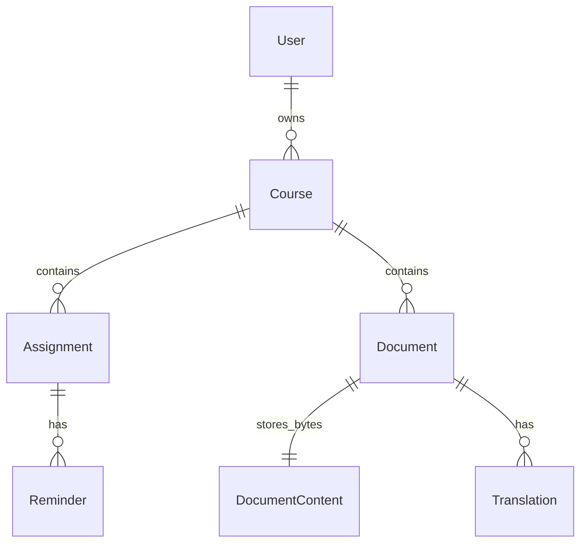
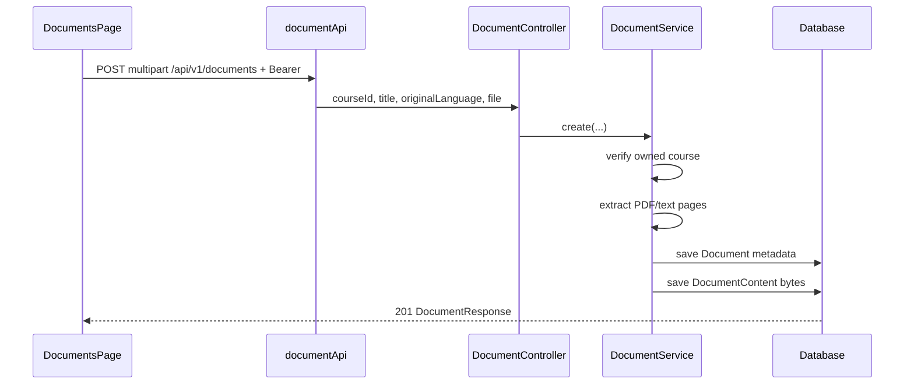
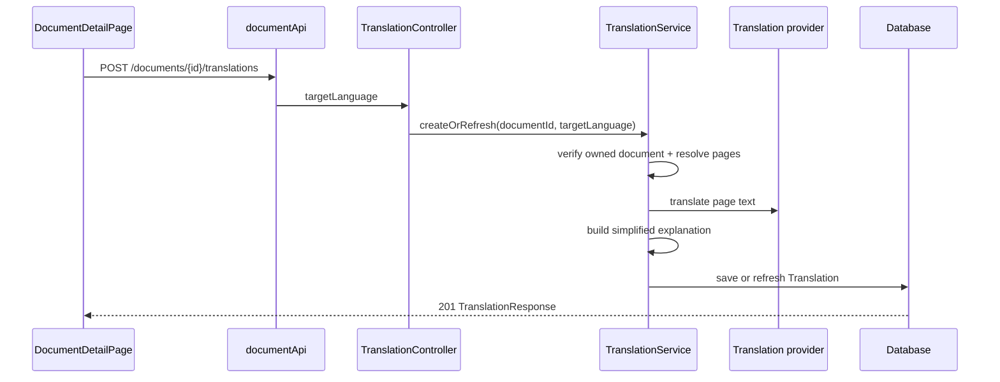
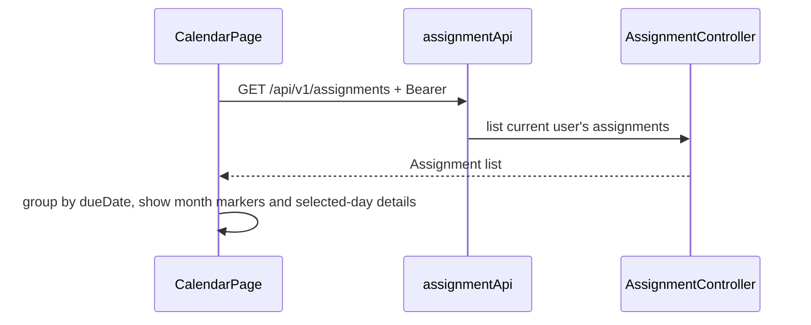
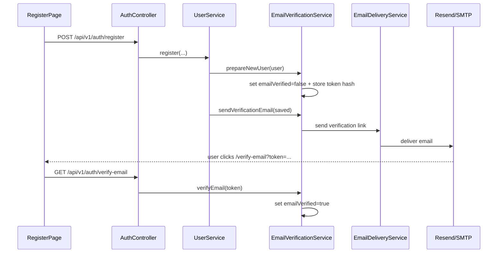
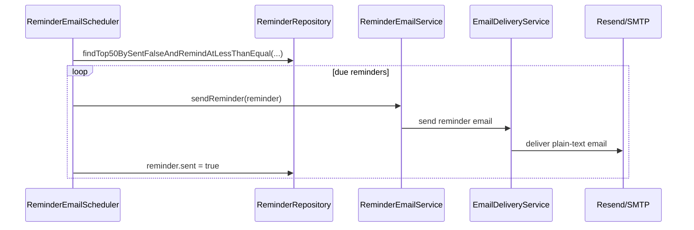

# Milestone 3: Final application — implementation and flow

> German edition (for coursework / professor): [MILESTONE3_FINAL.md](MILESTONE3_FINAL.md)  
> Builds on: [MILESTONE1_AUTHENTICATION_EN.md](MILESTONE1_AUTHENTICATION_EN.md), [MILESTONE2_BASE_FEATURES_EN.md](MILESTONE2_BASE_FEATURES_EN.md)

This document describes **Milestone 3 / final submission** in StudyBridge: the previously implemented authentication, courses, assignments, reminders, and dashboard are extended into the full application with **document upload**, **PDF/text extraction**, **backend-only translation**, **side-by-side document review**, **full calendar page**, **landing page**, **admin user management**, **email verification**, **production deployment configuration**, and **Resend/SMTP reminder emails**.

---

## 1. Assignment requirements and StudyBridge scope

The assignment sheet defines Milestone 3 as the **complete final application**. It also emphasizes REST server + frontend integration, quality, security, configuration, responsiveness, and a professional implementation.

| Requirement / quality point | StudyBridge implementation |
|-----------------------------|----------------------------|
| Complete final application | Auth, dashboard, courses, assignments, reminders, documents, translations, calendar, landing page, admin area |
| Client and REST server work together | React pages call Spring Boot REST endpoints through Axios with JWT |
| Professional, responsive UI | App shell, loading states, error alerts, search/filter controls, responsive pages |
| Security and authorization | JWT-protected `/api/v1/**`; user-scoped queries for courses, assignments, reminders, documents, translations; admin-only user management |
| Configuration / environment variables | JWT, CORS, translation provider, DeepL/MyMemory, Resend/SMTP email, PostgreSQL profile, Render deployment via properties/env vars |
| External services behind backend | Translation provider is called only by the Spring Boot backend, never directly by React |
| Error handling | Central backend exception handler + frontend `ErrorAlert` / API error mapping |
| Production persistence option | `prod` profile for PostgreSQL; `dev` profile remains H2 |
| Final email features | Email verification and reminder emails through a shared delivery service; Resend HTTP is used for Render, SMTP remains supported |

**Scope note:** Milestone 1 and 2 remain valid and are not repeated in full here. This document focuses on what was added for Milestone 3.

---

## 2. Final domain model

| Entity | Attributes (implementation) | Owner / link |
|--------|-----------------------------|--------------|
| **User** | id, name, email, passwordHash, preferredLanguage, role, enabled, emailVerified, emailVerificationTokenHash, emailVerificationExpiresAt, createdAt | — |
| **Course** | id, title, courseCode, semester, instructor, createdAt | `user_id` → User |
| **Assignment** | id, title, description, dueDate, status, createdAt | `course_id` → Course |
| **Reminder** | id, remindAt, reminderType, sent | `assignment_id` → Assignment |
| **Document** | id, title, originalFilename, contentType, fileSize, originalLanguage, extractedText, pageTexts, uploadDate | `course_id` → Course |
| **DocumentContent** | documentId, data | same primary key as Document |
| **Translation** | id, targetLanguage, translatedText, translatedPages, simplifiedText, simplifiedPages, createdAt | `document_id` → Document |



**Delete behavior:** Course-linked entities use database delete rules where configured (`@OnDelete`). Deleting a document through `DocumentService.delete(...)` removes both the metadata row and the stored `DocumentContent` bytes.

**Why `DocumentContent` exists:** Metadata is stored separately from the raw bytes so list/detail queries do not load large files. The file bytes are still persisted in the database, which is safer for deployments with ephemeral filesystems.

---

## 3. Security and data access

- All protected routes use `Authorization: Bearer <accessToken>`.
- Registration can require email verification. Unverified users cannot log in until `/api/v1/auth/verify-email` accepts their token.
- Admin access is granted through configured `ADMIN_EMAILS`; admin-only routes require `ROLE_ADMIN`.
- Admins can list users, disable/enable accounts, and delete other users. Disabled accounts cannot log in and existing JWTs are rejected.
- Document and translation access is user-scoped through the owning course (`document.course.user.id`).
- Uploads are linked to a course only after `CourseService.findOwnedCourseEntity(courseId)` verifies ownership.
- Translation is triggered through `/api/v1/documents/{documentId}/translations`; the frontend never receives provider credentials.
- DeepL API keys, MyMemory email, Resend API key, SMTP credentials, database credentials, and JWT secret are configured through environment variables.

---

## 4. REST API additions

Base URL: `http://localhost:8080` — protected routes require JWT.

### 4.1 Documents — `/api/v1/documents`

| Method | Path | Description |
|--------|------|-------------|
| `GET` | `/api/v1/documents` | List current user's documents |
| `GET` | `/api/v1/documents?courseId=1` | List documents for one owned course |
| `GET` | `/api/v1/documents?search=essay` | Search by document title |
| `GET` | `/api/v1/documents/{id}` | Get document metadata + extracted text/pages |
| `POST` | `/api/v1/documents` | Upload document as `multipart/form-data` → `201` |
| `GET` | `/api/v1/documents/{id}/download` | Download original file |
| `DELETE` | `/api/v1/documents/{id}` | Delete document → `204` |

**Upload form fields:**

| Field | Type | Meaning |
|-------|------|---------|
| `courseId` | number | Owned course id |
| `title` | string | Display title |
| `originalLanguage` | string | Source language, e.g. `German` |
| `file` | file | PDF or text-like file |

**Extraction behavior:**

- PDFs are parsed with **Apache PDFBox** page by page.
- Text-like files (`.txt`, `.md`, `.csv`, `.json`, `.xml`, `.html`, `.css`, `.java`, `.properties`, `.sql`, `.ts`, `.tsx`, `.yaml`, `.yml`) are stored as one text page.
- `extractedText` is the flat combined text; `pageTexts` keeps page alignment for side-by-side review.

---

### 4.2 Translations — `/api/v1/documents/{documentId}/translations`

| Method | Path | Description |
|--------|------|-------------|
| `GET` | `/api/v1/documents/{documentId}/translations` | List translations for an owned document |
| `POST` | `/api/v1/documents/{documentId}/translations` | Create or refresh translation for a target language → `201` |

**Request body:**

```json
{
  "targetLanguage": "English"
}
```

**Response includes:**

- `translatedText` and `translatedPages`
- `simplifiedText` and `simplifiedPages`
- `targetLanguage`, `documentId`, `createdAt`

**Provider behavior:**

- Default provider: `deepl`
- Alternatives: `mymemory`, `local`
- DeepL Free keys ending in `:fx` are routed to `https://api-free.deepl.com`; Pro keys use `https://api.deepl.com`.
- MyMemory chunks long text into smaller requests and can use an optional contact email.
- `local` mode is available for offline demos/tests and returns a labelled local draft.

---

### 4.3 Authentication additions — `/api/v1/auth`

Milestone 1 authentication remains in place, and the final version adds email verification:

| Method | Path | Description |
|--------|------|-------------|
| `POST` | `/api/v1/auth/register` | Creates a user. If verification is enabled, the response has `emailVerified=false` and a verification email is sent. |
| `GET` | `/api/v1/auth/login` | Basic auth login. Returns JWT only for enabled and verified users. |
| `GET` | `/api/v1/auth/verify-email?token=...` | Verifies the email token and enables login for that account. |
| `POST` | `/api/v1/auth/resend-verification` | Sends a fresh verification email for an unverified account. |

Existing users are treated as verified when the nullable database column has no value, so enabling verification does not lock out already-created accounts.

### 4.4 Admin user management — `/api/v1/admin/users`

Admin functionality is protected by `ROLE_ADMIN`. A user is promoted to admin when their email address is listed in `ADMIN_EMAILS`.

| Method | Path | Description |
|--------|------|-------------|
| `GET` | `/api/v1/admin/users` | List all users newest first |
| `PATCH` | `/api/v1/admin/users/{id}/enabled` | Enable or disable a user account |
| `DELETE` | `/api/v1/admin/users/{id}` | Delete another user and their owned course/document data |

Admins cannot disable or delete their own account.

---

## 5. Email verification and reminders

Milestone 2 implemented in-app reminders. Milestone 3 adds **email delivery** for both account verification and reminder notifications:

| Component | Behavior |
|-----------|----------|
| `EmailDeliveryService` | Shared sender for Resend HTTP API or SMTP |
| `EmailVerificationService` | Generates secure tokens, stores token hashes, sends verification links, verifies accounts |
| `ReminderEmailService` | Builds reminder emails for due assignments |
| `ReminderEmailScheduler` | Polls due unsent reminders, sends up to 50, marks successful ones as sent |
| Feature flags | Verification and reminders can be enabled separately |

Relevant configuration:

```properties
app.email-verification.enabled=${EMAIL_VERIFICATION_ENABLED:false}
app.email-verification.provider=${EMAIL_VERIFICATION_PROVIDER:smtp}
app.email-verification.from=${EMAIL_VERIFICATION_FROM:${app.email.default-from}}
app.email-verification.token-expiration-hours=${EMAIL_VERIFICATION_TOKEN_EXPIRATION_HOURS:24}
app.email.resend.api-key=${RESEND_API_KEY:}

app.reminders.email.enabled=${REMINDER_EMAIL_ENABLED:false}
app.reminders.email.provider=${REMINDER_EMAIL_PROVIDER:${app.email-verification.provider}}
app.reminders.email.from=${REMINDER_EMAIL_FROM:${app.email-verification.from}}
app.reminders.email.poll-ms=${REMINDER_EMAIL_POLL_MS:60000}

spring.mail.host=${MAIL_HOST:localhost}
spring.mail.port=${MAIL_PORT:587}
spring.mail.username=${MAIL_USERNAME:}
spring.mail.password=${MAIL_PASSWORD:}
```

For local development, SMTP remains available. For Render, Resend HTTP delivery is the safer production default because direct SMTP connections may time out on hosted infrastructure. If reminder delivery fails, the scheduler logs a warning and leaves the reminder unsent so it can be retried later.

---

## 6. Frontend structure

### Routes

| Route | Page | Features |
|-------|------|----------|
| `/` | `LandingPage` | Public product page, language/theme controls, sign-in/register CTAs |
| `/dashboard` | `DashboardPage` | Counts, due reminders, upcoming assignments, courses, calendar widget, document count |
| `/courses` | `CoursesPage` | Course CRUD |
| `/assignments` | `AssignmentsPage` | Assignment CRUD, status toggle, reminder UI |
| `/documents` | `DocumentsPage` | Upload, list, search, course filter, download, delete |
| `/documents/:id` | `DocumentDetailPage` | PDF/text view, generate translation, translation/simplified side panel |
| `/calendar` | `CalendarPage` | Month navigation, assignment markers, selected-day detail, status counts |
| `/admin/users` | `AdminUsersPage` | Admin-only user list with enable/disable and delete actions |
| `/verify-email` | `VerifyEmailPage` | Handles verification links from email |
| `/login`, `/register` | Auth pages | Basic login → JWT, registration |

### API clients

| File | Responsibility |
|------|----------------|
| `frontend/src/api/documentApi.ts` | Document upload/list/detail/download/delete + translation requests |
| `frontend/src/api/assignmentApi.ts` | Used by full calendar page |
| `frontend/src/api/adminUserApi.ts` | Admin user list, enable/disable, delete |
| `frontend/src/api/authApi.ts` | Registration, Basic login, email verification, resend verification |
| `frontend/src/api/client.ts` | Shared Axios instance and bearer token setup |

### Document detail UI

- Uses `react-pdf` / `pdfjs-dist` to render authenticated PDF bytes from the backend.
- Keeps original PDF/text on the left and translation or simplified explanation on the right.
- Preserves page alignment by using `pageTexts`, `translatedPages`, and `simplifiedPages`.
- Falls back to extracted text for non-PDF documents.

---

## 7. Configuration and deployment profiles

### Development profile

`application-dev.properties`

- H2 in-memory database
- H2 console enabled
- `ddl-auto=create-drop`
- SQL logging enabled

### Production profile

`application-prod.properties`

- PostgreSQL via `DATABASE_URL`, `DATABASE_USERNAME`, `DATABASE_PASSWORD`
- `ddl-auto=update` by default, configurable with `JPA_DDL_AUTO`
- H2 console disabled
- Hikari pool tuned for small/serverless PostgreSQL instances
- Email verification defaults to enabled in production.
- Resend is the default production email provider; SMTP remains available through provider configuration.

### Render deployment

`render.yaml`

- Builds the backend Docker image from `backend/Dockerfile`
- Uses `SPRING_PROFILES_ACTIVE=prod`
- Enables `autoDeploy: true`, so pushes to the connected branch redeploy automatically
- Declares the required production environment variables (`DATABASE_*`, `JWT_SECRET`, `ADMIN_EMAILS`, `FRONTEND_BASE_URL`, `EMAIL_VERIFICATION_FROM`, `RESEND_API_KEY`, `CORS_ORIGINS`)
- Sets production-safe defaults for `EMAIL_VERIFICATION_ENABLED=true`, `EMAIL_VERIFICATION_PROVIDER=resend`, and `REMINDER_EMAIL_ENABLED=true`

Run example:

```bash
SPRING_PROFILES_ACTIVE=prod mvn spring-boot:run
```

---

## 8. Workflows

### 8.1 Upload document



### 8.2 Generate translation



### 8.3 Full calendar



### 8.4 Email verification



### 8.5 Email reminder scheduler



---

## 9. Key files

### Backend

| Topic | Files |
|-------|-------|
| Document API | `controller/DocumentController.java`, `service/DocumentService.java`, `dto/DocumentResponse.java` |
| Document persistence | `model/Document.java`, `model/DocumentContent.java`, `repository/DocumentRepository.java`, `repository/DocumentContentRepository.java` |
| Translation API | `controller/TranslationController.java`, `service/TranslationService.java`, `service/TranslationClient.java` |
| Translation persistence | `model/Translation.java`, `repository/TranslationRepository.java`, `dto/TranslationRequest.java`, `dto/TranslationResponse.java` |
| Email delivery | `service/EmailDeliveryService.java`, `service/EmailVerificationService.java`, `service/ReminderEmailService.java`, `service/ReminderEmailScheduler.java` |
| Admin user management | `controller/AdminUserController.java`, `service/UserService.java`, `dto/AdminUserEnabledRequest.java` |
| Config | `application.properties`, `application-dev.properties`, `application-prod.properties` |
| Scheduling | `StudybridgeApplication.java` (`@EnableScheduling`) |

### Frontend

| Topic | Files |
|-------|-------|
| Documents | `pages/DocumentsPage.tsx`, `pages/DocumentDetailPage.tsx`, `components/DocumentUploadModal.tsx` |
| Document API/types | `api/documentApi.ts`, `types/document.ts` |
| Calendar | `pages/CalendarPage.tsx`, `components/Calendar.tsx` |
| Admin | `pages/AdminUsersPage.tsx`, `components/AdminRoute.tsx`, `api/adminUserApi.ts` |
| Email verification | `pages/VerifyEmailPage.tsx`, `api/authApi.ts` |
| Landing page | `pages/LandingPage.tsx`, `assets/hero.png` |
| Routing/layout | `routes/AppRoutes.tsx`, `layouts/AppLayout.tsx` |
| i18n/theme | `context/LanguageContext.tsx`, `i18n/translations.ts`, `context/ThemeContext.tsx` |

### Dependencies

| Dependency | Purpose |
|------------|---------|
| `org.apache.pdfbox:pdfbox` | Backend PDF text extraction |
| `spring-boot-starter-mail` | SMTP fallback for verification/reminder emails |
| `org.postgresql:postgresql` | Production database profile |
| `react-pdf` / `pdfjs-dist` | Frontend PDF rendering |

---

## 10. Tests and verification

Existing backend integration tests still cover:

- `AuthFlowIntegrationTest`
- `CourseCrudIntegrationTest`
- `AssignmentCrudIntegrationTest`
- `ReminderCrudIntegrationTest`
- `EmailVerificationIntegrationTest`
- `AdminUserManagementIntegrationTest`

Milestone 3 adds focused service tests:

| Test | Checks |
|------|--------|
| `ReminderEmailServiceTest` | Reminder email subject/body/recipient/from address/provider |
| `ReminderEmailSchedulerTest` | Due reminder polling, successful send marks `sent`, failed send remains retryable, disabled delivery does nothing |

Run:

```bash
cd backend
mvn test
```

**Current test gap:** Document upload/translation endpoints are implemented but do not yet have dedicated integration tests in the repository.

---

## 11. Manual final acceptance checklist

1. Register a new account and confirm the verification email is required before login.
2. Create at least one course.
3. Create assignments with different due dates and statuses.
4. Add reminders and confirm due reminders appear on the dashboard.
5. Open `/calendar`, move between months, select dates, and confirm assignment markers/details.
6. Open `/documents`, upload a PDF or text file linked to a course.
7. Search/filter documents, download the original file, and open the detail page.
8. Generate a translation in a target language and switch between translation and simplified explanation.
9. Confirm another user cannot access the uploaded document or translation.
10. As an admin, open `/admin/users`, list users, disable/enable a test user, and confirm disabled users cannot log in.
11. With Resend or SMTP configured, create a due unsent reminder and verify an email is sent and the reminder is marked sent.
12. Run with `SPRING_PROFILES_ACTIVE=prod` against PostgreSQL or confirm the Render deployment is on the latest commit.
13. Log out and verify protected routes redirect to login.

---

## 12. Submission summary

StudyBridge now satisfies the final milestone scope as a complete full-stack application:

1. **Milestone 1:** Basic login, JWT, BCrypt, protected routes.
2. **Milestone 2:** Course, Assignment, Reminder CRUD plus dashboard.
3. **Milestone 3:** Document upload/download, PDF/text extraction, backend-only translation, side-by-side document review, full calendar page, landing page, admin user management, email verification, production PostgreSQL profile, Render deployment config, and Resend/SMTP reminder emails.
4. **Architecture:** Spring Boot layers (controller → service → repository → JPA), React routes/components/API clients, user-scoped access, centralized error handling, environment-based configuration.

---

*Based on the StudyBridge repository and the Übung 2 assignment sheet. Update when APIs, UI, or deployment settings change.*
